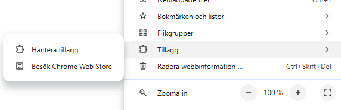

# text-enhancer-extension
## Plugin-användning

### Manuell Installation (Chrome)

1. [Ladda ned pluginet som ZIP-fil här](https://github.com/Pyrre1/text-enhancer-extension/raw/main/downloads/text-enhancer-extension.zip)
2. Unzippa filen, vanligtvis genom högerklick och packa upp eller liknande.
3. I ditt Chromefönster, gå till `chrome://extensions`, antingen genom att klicka på de tre prickarna uppe i hörnet, gå ner till `Tillägg` och klicka på hantera tillägg:

4. Aktivera **Developer Mode/Programmerarläge** 

5. Klicka på **Load unpacked/Läs in opaketerat tillägg** 

6. Välj den unzippade mappen.

7. Nu skall tillägget finns bland dina plugins:

