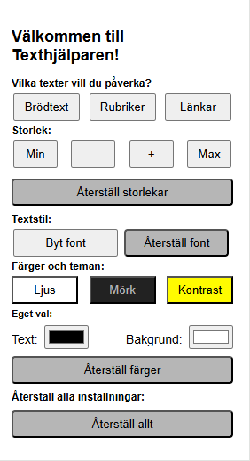
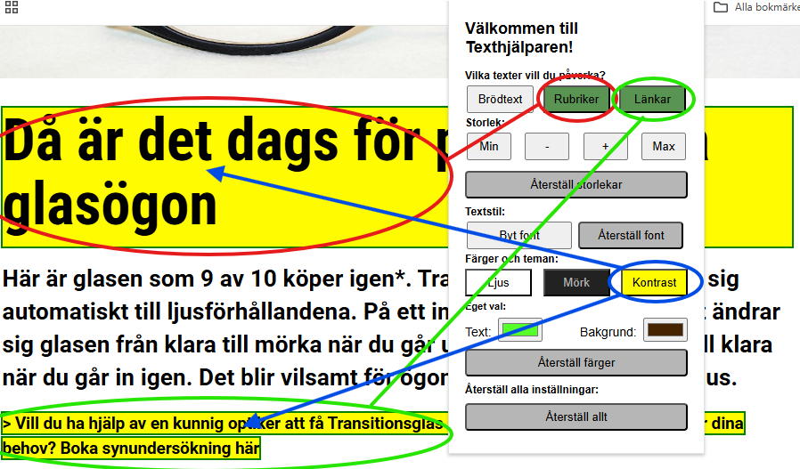

# text-enhancer-extension

Detta är en plugin till chrome. Den ger användaren möjlighet att välja olika textelement för att förändra utseendet på dessa. 

Innehåll:
<ol>
  <li>
    <a href="#plugin-användning">Användning</a>
    <ul>
      <li>
        <a href="#funktioner">Funktioner</a>
      </li>
    </ul>
  </li>
  <li>
    <a href="#kända-problem">Brister</a>
  </li>
  <li>
    <a href="#utförlig-manuell-installationsguide">Installationsguide</a>
  </li>
  <li>
    <a href="#snabbinstallation-för-den-mer-tekniskt-bevandrade">Snabbguide</a>
  </li>
</ol>

## Plugin-användning

Pluginet har en egen meny:

Där användaren kan välja vilka element som ska påverkas och sedan välja vad som skall ske med valda element.

De förvalda textelement som finns idag är `Brödtext` som är tänkt att vara all typ av text utom rubriker och länkar. `Rubriker`: alla typer av rubriker och underrubriker. `Länkar`: alla länkar.

### Funktioner
#### Textstorlek:
Textstorleken kan påverkas med `Min` - minsta möjliga, `-` - minska ett steg, `+` - öka ett steg, `Max` - sätt till största möjliga och till sist `Återställ storlekar` som återställer till den storlek som texten hade när pluginet öppnades.

#### Textstil
Textstilen är den font som används. Vissa läsare kan uppleva olika fontfamiljer olika lätta att läsa och ett set med fontfamiljer går att rotera mellan genom att klicka på `Byt font`, samt återställas genom `Återställ font`.

#### Färger och teman
Det finns tre förberedda teman, `Ljus`, `Mörk` och `Kontrast` som visar hur texten ser ut med knapparna. Det finns också möjlighet att själv välja färg på text och/eller bakgrund och valda element uppdateras när färgväljaren stannat på vald färg.
Även här finns en `Återställ färg` som återställer till så texten var när pluginet öppnades.

#### Återställ allt
Sist finns `Återställ allt` som återställer samtliga påverkningar till så det såg ut när pluginet öppnades.

## Kända problem
Då hemsidor är byggda på olika sätt finns idag ett problem med textelementselektorn på exempelvis IKEA's hemsida, där något element lägger sig framför innehållet och trots filtrering på textinnehåll till synes saknar text. Detta gör att pluginet som är i sin linda inte fungerar felfritt på alla hemsidor.

Stängs menyn ner så skrivs återställningsläget över nästa gång menyn öppnas. Saker som är implementerade för att klara en bredd av hemsidor skadar också viss funktion, och jag lyckades inte inom kursens tidsramar lösa detta på ett tillfredställande sätt.

## Utförlig manuell installationsguide
1. [Ladda ned pluginet som ZIP-fil här](https://github.com/Pyrre1/text-enhancer-extension/raw/main/downloads/text-enhancer-extension.zip)
2. Unzippa filen, vanligtvis genom högerklick och packa upp eller liknande.
3. I ditt Chromefönster, gå till `chrome://extensions`, antingen genom att fylla i  `chrome://extensions` i sökfältet, eller genom att klicka på de tre prickarna uppe i hörnet, gå ner till `Tillägg` och klicka på hantera tillägg:

4. Aktivera **Developer Mode/Programmerarläge** 

5. Klicka på **Load unpacked/Läs in opaketerat tillägg** 

6. Välj den unzippade mappen.

7. Nu skall tillägget finns bland dina plugins:

## Snabbinstallation för den mer tekniskt bevandrade.
1. [Ladda ned och unzippa filen på din dator](https://github.com/Pyrre1/text-enhancer-extension/raw/main/downloads/text-enhancer-extension.zip)
2. Gå till extensions i chrome `chrome://extensions` och aktivera programmerarläget.
3. Ladda upp mappen.

## Tester och krav

- [Kravspecifikation (Wiki)](https://github.com/Pyrre1/text-enhancer-extension/wiki/Kravspecifikation)
- [Testspecifikation och Testrapport (Wiki)](https://github.com/Pyrre1/text-enhancer-extension/wiki/Tester)
