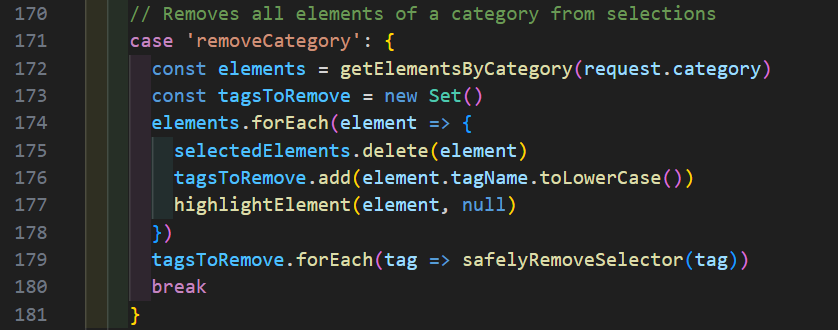
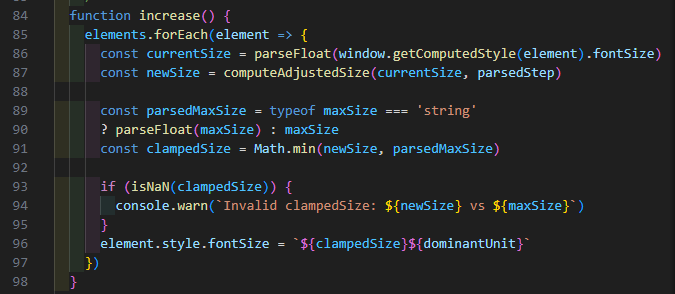
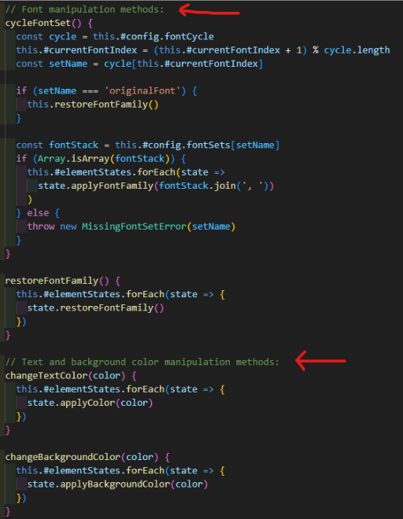
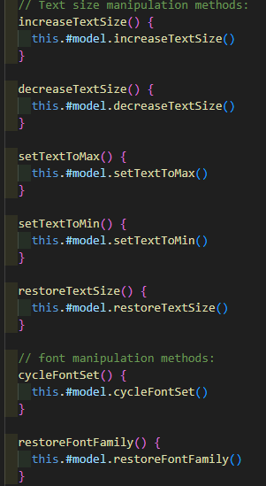
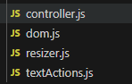
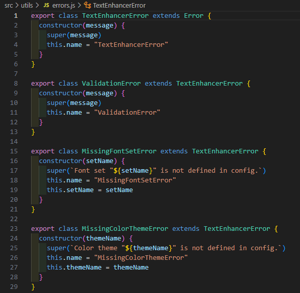

# Appen och refaktoriseringen av modulen.
Modulen har sedan L2 blivit helt omskriven för att följa clean code och för att göra koden mer lättarbetad och lättförstådd. Min "app" är ett plugin till Chrome som använder modulen för att kunna utföra sina önskade redigeringar av sodor.

## Kapitel 2 - Meningsfulla namn.
Meningsfulla namn är nog en av de saker som var lättast att ta till sig och som direkt har en tydlig påverkan i kodskrivandet upplever jag. Jag föredrog själv kortare namn, antingen ettordsnamn eller förkortningar för att det skulle "se snyggare ut". Men även om det blir fler bokstäver att läsa så läses variabler och metoder snabbare om de faktiskt säger något om vad de gör. Då modulen var skriven efter kapitlet om meningsfulla namn var läst tar jag exempel från min plug-in.

Här ser man att `removeCategory` syftar till att ta bort en kategori, och den börjar med att `getElementsByCategory`, där den önskade kategorin skickas med, sparar till `elements`. Sedan cyklas alla element igenom 'avmarkering' och 'selektering för att tas bort från aktiva element' och sedan körs `safelyRemoveSelector` på de element som ingår i kategorin.

## Kapitel 3 -Funktioner.
Funktioner är en av de saker jag haft svårast för då jag fastnat lite i gamla banor av att det är bra att hålla allt samlat på ett ställe. Som införstådd på vad som skrivits (av mig själv) har behovet inte varit tydligt innan, men efter workshopen där vi skulle sätta oss in i varandras kod utan bra instruktioner innan lyste det självklara i det!
Mitt främsta problem när all kod hamnade på samma ställe var att allt flöt ihop och L2 blev en monsterfil med 300 rader kod som egentligen skulle varit bättre att dela upp.
För att ha ett mindre exempel som får plats i en bild tar jag `increaseZ()` som efter refaktorisering fick bättre namn (Kapitel 2) `increaseZTextSize()` men också skrevs om från:

Med extrakontroller och en if-sats med varning/felhantering
Till:

Där bara storleksförändringen sker.

## Kapitel 4 - Kommentarer.
Jag har gått från att inte skriva kommentarer alls, till att skriva kanske lite för många kommentarer. Med ett helt kapitel tilldelat bara kommentarer insåg jag att även komentarer är ett konststycke, eller konststycket kanske snarare är att skriva kod som förklarar sig själv och inte försöka "sminka grisen" genom att överkommentera otydlig kod. Kommentarerna har sin plats, men den är inte överallt. Finns kommentarer på var och varannan rad kommer det bli ett bakgrunds-noise som stör läsning mer än de hjälper förståelsen.

Från att jag kommenterade varenda funktion i min första röriga `controller.js` där kommentarerna blev en del av textväggen:

Till att sätta kommentarer som visar att "nu har vi nått ett nytt stycke":

Nu när jag går igenom allt ännu en gång ser jag trots bokens till viss del aviga inställning till kommentarer att jag skulle kunnat lägga fler kommentarer som JSDOC. Jag ansåg JSDOC som lite jobbigt tidigare när det var en del av lintning i tidigare kurser och la inte stor vikt vid dem, men upplever själv stor nytta i att de dyker upp när man håller musen över metoder när de dyker upp utaför sitt kommenterade ställe. Självklart ska de följa bokens princip om att bara kommenteras om de bidrar med något och inte ses som en lösning på dåligt formulerad eller formatterad kod.

Jag har detta till trots fortfarande en del kommentarer som förklarar hur mer än varför, så det är uppenbarligen något jag behöver arbeta vidare på.

## Kapitel 5 - Formattering
Formattering är något som vi tidigt fick tips på: att använda automatisk formattering vid sparandet av dokument. Detta är en grundformattering som hjälper till med horosontella formatteringen i huvudsak och är i min mening en stor fördel att den hjälper till att hålla indenteringar jämna och därigenom ökar läsbarheten i koden.

Iom att det varit en självklarhet från början har steget till att inse fördelarn med att arbeta även med vertikal formattering. Jag försöker alltid hålla kod som påverkar samma saker i närheten av varandra. I mitt fall med plugin och modul har jag hållit logik som rör textens storlek på ett ställe, font på ett annat, färg på nästa osv.

Utöver det har jag även följt mönster internt, så för storlekspåverkande funktioner har jag "öka ett steg" tillsammans med "minska ett steg", sen min/max efter dem och sist en "återställ storlek" efter de som påverkar. samma med font och färg, först det som påverkar, sen återställ samma påverkan i anslutning till dem.

Exempel från `TextEnhancerController` med storlek och font:

## Kapitel 6 - Objekt och datastrukturer.
Efter att L2 lämnats in som mer eller mindre en fil med några stödfiler har strukturen förbättrats *enormt* genom att bli omskrivna på controller och model. Med denna uppdelning får vi en controller som orkestrerar logiken och sen delegerar till model, och därigenom döljs viss logik

Från kompakt filstruktur med stora långa filer med spridda ansvar:

Till en mer expanderad filstruktur med klarare syfte och uppdelat ansvar:

## Kapitel 7 - Felhantering.
Felhanteringen som lyfts fram i boken och föreläsningar med undantag hellre än fel var svårt att lösa och i L2 löste jag det genom magic numbers, som inte var helt optimalt. Då JavaScript inte stödjer undantag blev det en balansgång i felhantering med errors och "tvångslösningar" på felaktig indata.
I L3 och med refaktoriseringen av modulen valde jag att skapa en egen errorhantering för att göra den mer anpassad. Jag ersatte magiska nummer med variabler för att inte introducera hårdkodade fel i koden.

## Kapitel 8 -

## Kapitel 9 -

## Kapitel 10 -

## Kapitel 11 -
